# BMad-SAFe Method — User Guide

This guide explains the SAFe 6.0.1 compliant workflow for the BMad-SAFe module.

## The SAFe Agile Development Lifecycle

BMad-SAFe follows the Scaled Agile Framework with a complete hierarchy from Strategic Themes to Tasks.

### SAFe Backlog Hierarchy

```mermaid
graph TD
    ST["🎯 Strategic Theme"] --> E["📦 Epic"]
    E --> C["🔷 Capability"]
    C --> F["✨ Feature"]
    F --> S["📝 Story"]
    S --> T["✅ Task"]

    style ST fill:#6a1b9a,color:#fff
    style E fill:#7b1fa2,color:#fff
    style C fill:#9c27b0,color:#fff
    style F fill:#ab47bc,color:#fff
    style S fill:#ce93d8,color:#000
    style T fill:#e1bee7,color:#000
```



### The SAFe Planning Workflow

Before PI execution begins, BMad-SAFe follows a structured planning workflow:

```mermaid
graph TD
    A["Start: Strategic Theme"] --> B{"Optional: Research"}
    B -->|Yes| C["Mary (BA): Market/Domain Research"]
    B -->|No| D
    C --> C2["Mary (BA): Create Product Brief"]
    C2 --> D["John (PM): Create PRD with WSJF"]
    D --> E["Sally (UX): Create UX Design"]
    E --> F["Winston (Architect): Create Architecture"]
    F --> F2["Winston (Architect): Solution Intent + Runway"]
    F2 --> G["John (PM): Create Epics & Stories"]
    G --> G2["Oliver (PO): WSJF Prioritization"]
    G2 --> H["Winston (Architect): Implementation Readiness"]
    H --> I{Documents Aligned?}
    I -->|Yes| J["Planning Complete"]
    I -->|No| K["Update PRD/Architecture"]
    K --> H
    J --> L["📅 Ready for PI Planning"]

    style A fill:#6a1b9a,color:#fff
    style B fill:#e3f2fd,color:#000
    style C fill:#e8f5e9,color:#000
    style C2 fill:#e8f5e9,color:#000
    style D fill:#fff3e0,color:#000
    style E fill:#e1f5fe,color:#000
    style F fill:#f3e5f5,color:#000
    style F2 fill:#f3e5f5,color:#000
    style G fill:#fff3e0,color:#000
    style G2 fill:#fce4ec,color:#000
    style H fill:#f3e5f5,color:#000
    style I fill:#e3f2fd,color:#000
    style J fill:#34a853,color:#fff
    style K fill:#f9ab00,color:#fff
    style L fill:#1a73e8,color:#fff
```



### PI Planning Event (2-Day)

The heartbeat of the ART:

```mermaid
graph TD
    subgraph Day1["📆 Day 1: Vision & Planning"]
        A["Derek (RTE): Business Context"] --> B["John (PM): Product Vision + Roadmap"]
        B --> C["Winston (Architect): Architecture Vision"]
        C --> D["Teams: Breakout Sessions"]
        D --> E["All: Draft Plan Review"]
    end

    subgraph Day2["📆 Day 2: Finalization"]
        F["Derek (RTE): Planning Adjustments"] --> G["Teams: Finalize PI Objectives"]
        G --> H["All: Final Plan Review"]
        H --> I["Derek (RTE): ROAM Risks"]
        I --> J["All: Confidence Vote"]
        J --> K["Derek (RTE): Planning Retro"]
    end

    E --> F
    K --> L["✅ PI Objectives Committed"]

    style A fill:#e8f5e9,color:#000
    style B fill:#fff3e0,color:#000
    style C fill:#f3e5f5,color:#000
    style D fill:#e3f2fd,color:#000
    style E fill:#e3f2fd,color:#000
    style F fill:#e8f5e9,color:#000
    style G fill:#e3f2fd,color:#000
    style H fill:#e3f2fd,color:#000
    style I fill:#ffcdd2,color:#000
    style J fill:#ffd54f,color:#000
    style K fill:#e8f5e9,color:#000
    style L fill:#34a853,color:#fff
```



### The Core Iteration Cycle (IDE)

Once PI Planning is complete, BMad-SAFe follows this development workflow:

```mermaid
graph TD
    A["🚀 Iteration Start"] --> B["Bob (SM): Iteration Planning"]
    B --> C["Oliver (PO): Create Story with Context"]
    C --> D{"Story Ready?"}
    D -->|Needs Work| C
    D -->|Approved| E["Amelia (Dev): Dev Story"]
    E --> F["Amelia (Dev): Implement Tasks + Tests"]
    F --> G["Quinn (QA): Code Review"]
    G --> H{Review Decision}
    H -->|Needs Fixes| E
    H -->|Approved| I["✅ Mark Story Complete"]
    I --> J{More Stories?}
    J -->|Yes| C
    J -->|No| K["Bob (SM): Iteration Review"]
    K --> L["Bob (SM): Retrospective"]
    L --> M{Last Iteration?}
    M -->|No| B
    M -->|Yes| N["Derek (RTE): System Demo"]

    style A fill:#1a73e8,color:#fff
    style B fill:#e8f5e9,color:#000
    style C fill:#fce4ec,color:#000
    style D fill:#e3f2fd,color:#000
    style E fill:#e3f2fd,color:#000
    style F fill:#e3f2fd,color:#000
    style G fill:#ffd54f,color:#000
    style H fill:#e3f2fd,color:#000
    style I fill:#34a853,color:#fff
    style J fill:#e3f2fd,color:#000
    style K fill:#e8f5e9,color:#000
    style L fill:#e8f5e9,color:#000
    style M fill:#e3f2fd,color:#000
    style N fill:#1a73e8,color:#fff
```



### PI Execution Events

Weekly sync events during PI execution:

```mermaid
graph TD
    subgraph Weekly["🔄 Weekly ART Events"]
        A["Derek (RTE): ART Sync"] --> B["John (PM): PO Sync"]
    end

    subgraph EndOfPI["📊 End of PI"]
        C["Derek (RTE): System Demo"] --> D["Derek (RTE): Quantitative Review"]
        D --> E["Derek (RTE): Problem-Solving Workshop"]
        E --> F["All: Improvement Items"]
    end

    Weekly --> EndOfPI
    F --> G["🔁 Next PI Planning"]

    style A fill:#e8f5e9,color:#000
    style B fill:#fff3e0,color:#000
    style C fill:#1a73e8,color:#fff
    style D fill:#f3e5f5,color:#000
    style E fill:#ffcdd2,color:#000
    style F fill:#ffd54f,color:#000
    style G fill:#6a1b9a,color:#fff
```



---

## Agent & Workflow Quick Reference

### Planning Phase Agents

| Agent               | Command           | Workflow                 | Output                  |
| ------------------- | ----------------- | ------------------------ | ----------------------- |
| Mary (BA)           | `@analyst BP`     | Brainstorm Project       | Brainstorming notes     |
| Mary (BA)           | `@analyst RS`     | Research                 | Research document       |
| Mary (BA)           | `@analyst CB`     | Create Brief             | Product Brief           |
| John (PM)           | `@pm CP`          | Create PRD               | PRD with WSJF           |
| Sally (UX)          | `@ux-designer CU` | Create UX                | UX Spec                 |
| Winston (Architect) | `@architect CA`   | Create Architecture      | Solution Intent         |
| John (PM)           | `@pm CE`          | Create Epics & Stories   | Epic/Feature/Story list |
| Winston (Architect) | `@architect IR`   | Implementation Readiness | Readiness Report        |

### PI Events Agents (RTE)

| Agent       | Command   | Workflow        | Output                    |
| ----------- | --------- | --------------- | ------------------------- |
| Derek (RTE) | `@rte PP` | PI Planning     | PI Objectives, ROAM risks |
| Derek (RTE) | `@rte AS` | ART Sync        | Sync notes                |
| Derek (RTE) | `@rte SD` | System Demo     | Demo notes                |
| Derek (RTE) | `@rte IA` | Inspect & Adapt | I&A report                |

### Product Owner Agents

| Agent       | Command  | Workflow         | Output              |
| ----------- | -------- | ---------------- | ------------------- |
| Oliver (PO) | `@po TB` | Team Backlog     | Prioritized backlog |
| Oliver (PO) | `@po SR` | Story Refinement | Refined stories     |
| Oliver (PO) | `@po IG` | Iteration Goals  | Iteration goals     |
| Oliver (PO) | `@po CS` | Create Story     | Ready story         |

### Iteration Agents

| Agent        | Command   | Workflow                  | Output           |
| ------------ | --------- | ------------------------- | ---------------- |
| Bob (SM)     | `@sm SP`  | Sprint/Iteration Planning | Iteration plan   |
| Bob (SM)     | `@sm CS`  | Create Story              | Ready story      |
| Bob (SM)     | `@sm ER`  | Epic Retrospective        | Retro notes      |
| Amelia (Dev) | `@dev DS` | Dev Story                 | Implemented code |
| Amelia (Dev) | `@dev CR` | Code Review               | Review report    |
| Quinn (QA)   | `@qa QA`  | Automate                  | Test suite       |

### PM Weekly Events

| Agent     | Command  | Workflow | Output          |
| --------- | -------- | -------- | --------------- |
| John (PM) | `@pm PS` | PO Sync  | Alignment notes |

---

## SAFe Templates

All SAFe templates are in `templates/safe/`:

| Template                    | Purpose         | Key Fields                   |
| --------------------------- | --------------- | ---------------------------- |
| `theme-template.md`         | Strategic Theme | WSJF, Investment Category    |
| `epic-template.md`          | Business Epic   | WSJF, Enabler flag, PI range |
| `capability-template.md`    | Capability      | Parent Epic, Child Features  |
| `feature-template.md`       | Feature         | Benefit Hypothesis, WSJF     |
| `story-template.md`         | User Story      | INVEST, Acceptance Criteria  |
| `task-template.md`          | Task            | Time tracking, State         |
| `pi-objectives-template.md` | PI Objectives   | SMART, Confidence Vote       |
| `roam-risk-template.md`     | Risk Board      | ROAM categories              |
| `wsjf-calculator.md`        | Prioritization  | CoD, Job Size                |

---

## Complete Workflow Commands

### Planning Phase

```bash
@analyst BP    # Brainstorm Project
@analyst RS    # Research
@analyst CB    # Create Brief
@pm CP         # Create PRD
@ux-designer CU # Create UX
@architect CA  # Create Architecture
@pm CE         # Create Epics & Stories
@architect IR  # Implementation Readiness
```

### PI Planning & Events

```bash
@rte PP        # PI Planning Event (2-day)
@rte AS        # ART Sync (weekly)
@rte SD        # System Demo (PI end)
@rte IA        # Inspect & Adapt (PI end)
```

### Product Owner

```bash
@po TB         # Team Backlog Management
@po SR         # Story Refinement
@po IG         # Iteration Goals
@po CS         # Create Story
```

### Iteration Execution

```bash
@sm SP         # Iteration Planning
@sm CS         # Create Story
@dev DS        # Dev Story
@dev CR        # Code Review
@qa QA         # Automate Tests
@sm ER         # Epic Retrospective
```

### Weekly Sync

```bash
@rte AS        # ART Sync
@pm PS         # PO Sync
```

---

## SAFe Workflow Paths

All workflows located in `_bmad-safe/bmm-safe/workflows/4-implementation/`:

| Folder              | Agent  | Purpose                    |
| ------------------- | ------ | -------------------------- |
| `pi-planning/`      | RTE    | 2-day PI Planning event    |
| `art-sync/`         | RTE    | Weekly ART synchronization |
| `system-demo/`      | RTE    | PI System Demo             |
| `inspect-adapt/`    | RTE    | PI-end I&A event           |
| `team-backlog/`     | PO     | Backlog management         |
| `story-refinement/` | PO     | Feature→Story breakdown    |
| `iteration-goals/`  | PO     | Define iteration goals     |
| `po-sync/`          | PM     | Weekly PO alignment        |
| `sprint-planning/`  | SM     | Iteration planning         |
| `create-story/`     | SM/PO  | Story preparation          |
| `dev-story/`        | Dev    | Implementation             |
| `code-review/`      | Dev/QA | Code review                |
| `retrospective/`    | SM     | Epic retrospective         |
