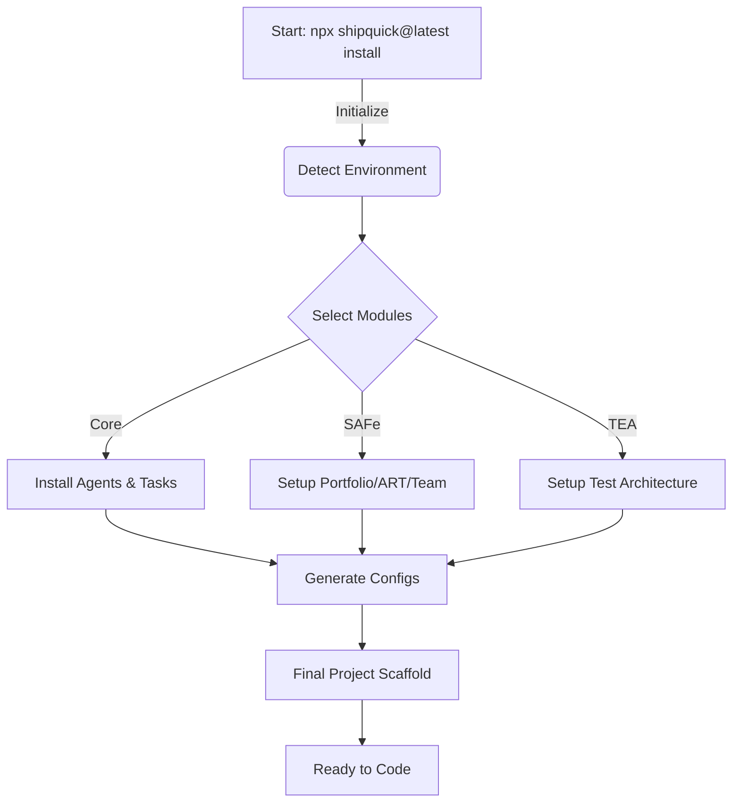

# 🚀 Shipquick Enterprise (BMad + SAFe 6.0)

**The AI-Powered Scaled Agile Framework for Agentic Development**

Shipquick is an enterprise-grade framework that combines the **BMad Method** (Agent-driven development) with **SAFe 6.0** (Scaled Agile Framework) and **Beads** (Local State Management).

---

## What is Shipquick?

Shipquick gives you a team of **18 specialized AI agents** to help you build software - from initial idea to production code. It provides structured, automated workflows (35+) designed to scale agile development in your IDE.

### Key Features

- 🤖 **18 AI Agents** - Each with specialized expertise (PM, Architect, Dev, QA, etc.)
- 📋 **35 Workflows** - Structured processes from ideation to deployment
- 🔄 **SAFe 6.0.1 Aligned** - Enterprise-grade agile methodology
- 🔗 **Beads State Tracking** - Never lose work context between sessions
- 📁 **IDE Integration** - Optimized for Cursor, VS Code, and Windsurf

---

## 🚀 How It Works (The Flow)



---

## 🎓 Step-by-Step Training Guide

Follow these steps to transform an empty folder into a fully functional Agentic Software Factory.

### Step 1: Initialize the Factory

```bash
npx shipquick@latest install
```

### Step 2: Configure Your Factory

Select modules (Core, BMad, SAFe, TEA) and choose your preferred AI IDE.

### Step 3: Verify the Setup

Check relevant folders (`_bmad/`, `.agent/`, `_bmad/sq/`) and the `agents.md` manifest.

### Step 4: Start Building

Use the `/pm` or `/dev` commands to initiate workflows and use `bd` to track progress.

---

## 🤖 The AI Team

| Agent        | Role                   | Context                       |
| ------------ | ---------------------- | ----------------------------- |
| `/analyst`   | Business Analysis      | Market research & Ideation    |
| `/pm`        | Product Management     | Requirements & Prioritization |
| `/architect` | System Architecture    | Tech decisions & Design       |
| `/dev`       | Development            | Code implementation           |
| `/qa`        | Quality Assurance      | Testing & Automation          |
| `/sm`        | Scrum Master           | Sprint management & tracking  |
| `/rte`       | Release Train Engineer | PI Planning & Coordination    |

---

## 🔄 Repository Structure

- **`_bmad/`**: Core framework definitions (Agents, Tasks).
- **`.agent/`**: Workflow definitions (Phases 1-6).
- **`_npm-package/`**: Source code for the CLI installer.
- **`.beads/`**: Local state database (for Contributors).
- **`_bmad-output/`**: Generated artifacts and reports.
- **`agents.md`**: Agent manifesto and rules.

---

## 📦 For Contributors

If you want to modify the Shipquick installer itself:

- **Source Code**: Located in `_npm-package/`.
- **Build**: Run `npm run bundle` inside `_npm-package/`.
- **Test**: Run `npm link` and then `shipquick install` to test local changes.

---

**Made with ❤️ by CivilEngineersCanAlsoCode**
